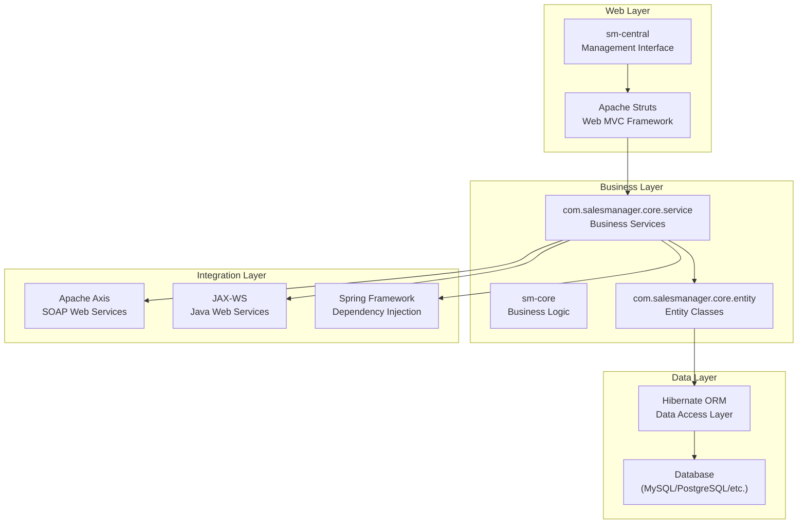

# Architecture Documentation — ShopizerApp

## System Architecture



## Frontend Architecture

### Component Hierarchy

The application uses **Apache Struts** as the primary web framework:

```
Struts ActionServlet
├── Central Management Actions
│   ├── BaseAction (common functionality)
│   ├── PageBaseAction (page-specific base)
│   ├── CountrySelectBaseAction (internationalization)
│   └── AuthorizationException (security)
│
├── Shopping Cart Actions
│   ├── AddProduct (add items to cart)
│   ├── CartPropertiesAction (cart configuration)
│   ├── IntegrationAction (external integration)
│   └── SiteMapAction (navigation)
│
└── Product Catalog Actions
    ├── EditCategoryAction (category management)
    ├── EditProductAction (product CRUD)
    ├── EditProductAttributesAction (product attributes)
    ├── EditProductOptionsAction (product options)
    ├── EditProductPriceAction (pricing)
    ├── ProductListAction (product listing)
    ├── ProductPreviewAction (product preview)
    ├── ProductReviewAction (product reviews)
    └── [additional product management actions]
```

### State Management

The application uses **traditional Java EE patterns**:

| Pattern | Usage |
|---|---|
| **Action Classes** | Struts actions handle HTTP requests |
| **Form Beans** | Struts form beans for data binding |
| **Session Management** | HTTP session for user state |
| **Entity Classes** | Hibernate entities for data persistence |
| **Service Layer** | Business logic in service classes |

### Data Flow

```
HTTP Request → Struts Action → Service Layer → Entity Layer → Hibernate → Database
```

---

## Backend Architecture

### Module Structure

The backend is organized into **two primary modules**:

#### 1. sm-core Module
**Core business logic and data access**

```
sm-core/
├── src/com/salesmanager/core/
│   ├── entity/                     # Hibernate entity classes
│   ├── service/                    # Business service interfaces
│   └── module/                     # Module definitions
├── conf/                           # Configuration
│   ├── hibernate/                  # ORM configuration
│   ├── properties/                 # Application properties
│   └── spring/                     # Spring configuration
└── lib/                            # External dependencies
```

#### 2. sm-central Module
**Web management interface**

```
sm-central/
├── src/com/salesmanager/
│   ├── central/                    # Base management actions
│   ├── cart/                       # Shopping cart actions
│   └── catalog/                    # Product catalog actions
└── [configuration files]
```

### External Integration

The application provides **SOAP web services** through two technologies:

1. **Apache Axis** — Legacy SOAP implementation
2. **JAX-WS** — Java standard web services

**Web Service Endpoints**:
- Product management services
- Cart integration services
- Catalog query services

### Data Persistence

**Hibernate ORM** provides database abstraction:

- **Entity Classes**: `com.salesmanager.core.entity.*`
- **Service Layer**: `com.salesmanager.core.service.*`
- **Configuration**: XML-based Hibernate configuration
- **Database Support**: Vendor-agnostic (MySQL, PostgreSQL, etc.)

---

## Design Patterns

### Patterns Used

| Pattern | Where | Description |
|---|---|---|
| **MVC Pattern** | Struts Actions | Model-View-Controller via Struts |
| **DAO Pattern** | Hibernate Entities | Data Access Object pattern |
| **Service Layer** | Service Classes | Business logic abstraction |
| **Dependency Injection** | Spring Framework | IoC container for dependencies |
| **Front Controller** | Struts ActionServlet | Single entry point for requests |

### Anti-Patterns Observed

| Anti-Pattern | Impact | Location |
|---|---|---|
| **Legacy Java Version** | Security vulnerabilities, compatibility issues | Java 1.5.0 |
| **Windows-specific Paths** | Portability issues | `C:\tmp` in build.xml |
| **Deprecated Web Services** | Maintenance burden, security risks | Axis framework |
| **No Modern Build System** | Dependency management issues | Ant instead of Maven |
| **Hard-coded Configuration** | Flexibility limitations | XML configuration files |

---

## Security Considerations

| Concern | Status | Notes |
|---|---|---|
| **Java Version** | Critical | Java 1.5.0 has known security vulnerabilities |
| **Framework Versions** | High | Legacy versions of Struts, Spring, Hibernate |
| **Web Services** | Medium | Axis framework has security issues |
| **Input Validation** | Unknown | No validation patterns visible in code |
| **Authentication** | Unknown | AuthorizationException suggests auth framework |
| **SQL Injection** | Unknown | Depends on Hibernate usage patterns |
| **XSS Protection** | Unknown | Struts may provide some protection |

---

## Performance Considerations

| Area | Current State | Impact |
|---|---|---|
| **Java Version** | Java 1.5.0 | Very outdated, poor performance |
| **Framework Versions** | Legacy versions | Performance optimizations missing |
| **Database Access** | Hibernate ORM | Depends on query optimization |
| **Web Services** | SOAP-based | Slower than REST APIs |
| **Build System** | Ant | Slower than modern build tools |
| **Memory Management** | Java 1.5.0 | Outdated garbage collection |

---

## Technical Debt

### Priority 1 — Critical

| ID | Debt Item | Location | Impact |
|---|---|---|---|
| **TD-01** | **Java 1.5.0** — 20+ year old Java version | Entire project | Security vulnerabilities, compatibility issues |
| **TD-02** | **Legacy Frameworks** — Old Struts, Spring, Hibernate | All modules | Security risks, missing features |
| **TD-03** | **Ant Build System** — No modern dependency management | `build.xml` | Dependency hell, build issues |

### Priority 2 — High

| ID | Debt Item | Location | Impact |
|---|---|---|---|
| **TD-04** | **Windows-specific Paths** — Hard-coded Windows paths | `build.xml` | Portability issues |
| **TD-05** | **Apache Axis** — Deprecated SOAP framework | Web services | Security vulnerabilities |
| **TD-06** | **No Modern Testing** — No visible test framework | Project structure | Quality assurance issues |

### Priority 3 — Medium

| ID | Debt Item | Location | Impact |
|---|---|---|---|
| **TD-07** | **XML Configuration** — Heavy XML configuration | `conf/` directories | Maintenance burden |
| **TD-08** | **No REST APIs** — Only SOAP web services | Integration layer | Modern integration limitations |
| **TD-09** | **No Containerization** — No Docker/deployment configs | Project root | Deployment complexity |
