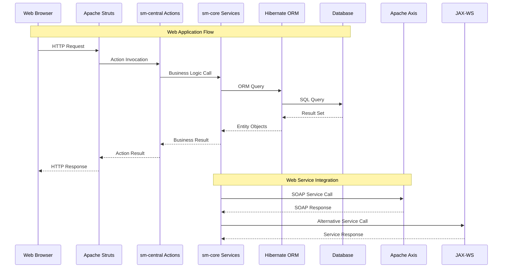

# Integration Architecture — ShopizerApp

## Overview

ShopizerApp is a **monolithic Java enterprise application** that integrates multiple legacy technologies. The architecture follows traditional Java EE patterns with Struts for web layer, Spring for dependency injection, and Hibernate for data persistence. Integration is primarily through internal module communication and SOAP web services.

## Communication Architecture



---

## Module Integration

### Internal Module Communication

**sm-central → sm-core Integration**:

```java
// Example from ProductListAction.java
public class ProductListAction extends BaseAction {
    // Calls to sm-core services
    // ProductService productService = getProductService();
    // List<Product> products = productService.getProducts();
}
```

**Data Flow Pattern**:
1. **Struts Action** receives HTTP request
2. **Action Class** calls sm-core business services
3. **Service Layer** interacts with Hibernate entities
4. **Hibernate ORM** executes database operations
5. **Results** flow back through the same chain

### Service Layer Integration

**Service Interface Pattern**:
```java
// Hypothetical service interface
public interface ProductService {
    List<Product> getProducts();
    Product getProductById(Long id);
    void saveProduct(Product product);
    void deleteProduct(Long id);
}
```

**Integration Points**:
- **Product Management**: CRUD operations via service layer
- **Shopping Cart**: Cart state management through services
- **Catalog Management**: Product catalog operations
- **User Management**: Authentication and authorization

---

## External Integration

### SOAP Web Services

**Apache Axis Integration**:
- **Location**: `sm-core/lib/axis/`
- **Purpose**: Legacy SOAP web services
- **Usage**: External system integration
- **Status**: Deprecated technology

**JAX-WS Integration**:
- **Location**: `sm-core/lib/jax-ws/`
- **Purpose**: Java standard web services
- **Usage**: Alternative SOAP implementation
- **Status**: Legacy but standard

### Web Service Endpoints

**Product Services** (inferred from codebase):
```java
// Hypothetical service endpoints
@WebService
public interface ProductServiceWS {
    @WebMethod
    List<ProductDTO> getProducts();
    
    @WebMethod
    ProductDTO getProduct(@WebParam(name = "id") Long id);
    
    @WebMethod
    void updateProduct(@WebParam(name = "product") ProductDTO product);
}
```

**Cart Services** (inferred from codebase):
```java
@WebService
public interface CartServiceWS {
    @WebMethod
    CartDTO getCart(@WebParam(name = "sessionId") String sessionId);
    
    @WebMethod
    void addToCart(@WebParam(name = "productId") Long productId, 
                   @WebParam(name = "quantity") Integer quantity);
}
```

---

## Database Integration

### Hibernate ORM Integration

**Configuration Location**: `sm-core/conf/hibernate/`

**Entity Integration Pattern**:
```java
// Hypothetical entity class
@Entity
@Table(name = "products")
public class Product {
    @Id
    @GeneratedValue(strategy = GenerationType.IDENTITY)
    private Long id;
    
    @Column(name = "name")
    private String name;
    
    @Column(name = "price")
    private BigDecimal price;
    
    // Additional fields and relationships
}
```

**Database Support**:
- **MySQL**: Primary database support
- **PostgreSQL**: Alternative database support
- **H2**: Development/testing database
- **HSQLDB**: Lightweight database option

### Transaction Management

**Spring Transaction Integration**:
- **Configuration**: `sm-core/conf/spring/`
- **Annotation-based**: `@Transactional`
- **XML-based**: Transaction declarations
- **Hibernate Integration**: Session management

---

## Configuration Integration

### Spring Framework Integration

**Bean Configuration** (`sm-core/conf/spring/`):
```xml
<!-- Hypothetical Spring configuration -->
<bean id="productService" class="com.salesmanager.core.service.ProductServiceImpl">
    <property name="productDao" ref="productDao"/>
</bean>

<bean id="productDao" class="com.salesmanager.core.dao.ProductDaoImpl">
    <property name="sessionFactory" ref="sessionFactory"/>
</bean>
```

### Hibernate Configuration

**ORM Configuration** (`sm-core/conf/hibernate/`):
```xml
<!-- Hypothetical Hibernate configuration -->
<hibernate-configuration>
    <session-factory>
        <property name="hibernate.connection.driver_class">com.mysql.jdbc.Driver</property>
        <property name="hibernate.connection.url">jdbc:mysql://localhost:3306/shopizer</property>
        <property name="hibernate.dialect">org.hibernate.dialect.MySQLDialect</property>
        <mapping class="com.salesmanager.core.entity.Product"/>
    </session-factory>
</hibernate-configuration>
```

### Application Properties

**Configuration Files** (`sm-core/conf/properties/`):
- Database connection settings
- Application-specific properties
- Internationalization messages
- Business logic configuration

---

## Integration Issues & Risks

| Issue | Severity | Description |
|---|---|---|
| **Legacy Java Version** | Critical | Java 1.5.0 has compatibility issues with modern systems |
| **Deprecated Frameworks** | High | Axis, old Struts versions have security vulnerabilities |
| **Tight Coupling** | High | Modules tightly coupled, difficult to extract services |
| **No REST APIs** | Medium | Only SOAP web services, no modern REST integration |
| **XML Configuration** | Medium | Heavy XML configuration, difficult to maintain |
| **No API Versioning** | Medium | Web services lack versioning strategy |
| **Database Dependencies** | Low | Hibernate provides some abstraction |

---

## Recommended Improvements

### Modernization Strategy

1. **Java Version Upgrade**:
   - Upgrade to Java 8 or higher
   - Address security vulnerabilities
   - Enable modern language features

2. **Framework Modernization**:
   - Replace Axis with REST APIs (Spring Boot)
   - Upgrade Struts to modern version
   - Migrate to Spring Boot for simplified configuration

3. **Build System Migration**:
   - Migrate from Ant to Maven/Gradle
   - Implement proper dependency management
   - Add modern testing frameworks

4. **Service Extraction**:
   - Extract business logic into microservices
   - Implement REST API layer
   - Add API versioning strategy

5. **Database Modernization**:
   - Implement database migration tools (Flyway/Liquibase)
   - Add connection pooling
   - Optimize Hibernate queries

### Integration Architecture Changes

**Current**: Monolithic with SOAP services
```
Monolith → SOAP → External Systems
```

**Recommended**: Microservices with REST APIs
```
API Gateway → Microservices → REST → External Systems
```

**Benefits**:
- **Scalability**: Individual service scaling
- **Maintainability**: Smaller, focused services
- **Technology Flexibility**: Different tech stacks per service
- **Deployment Independence**: Separate deployment cycles
- **Modern Integration**: REST APIs, message queues, event-driven
